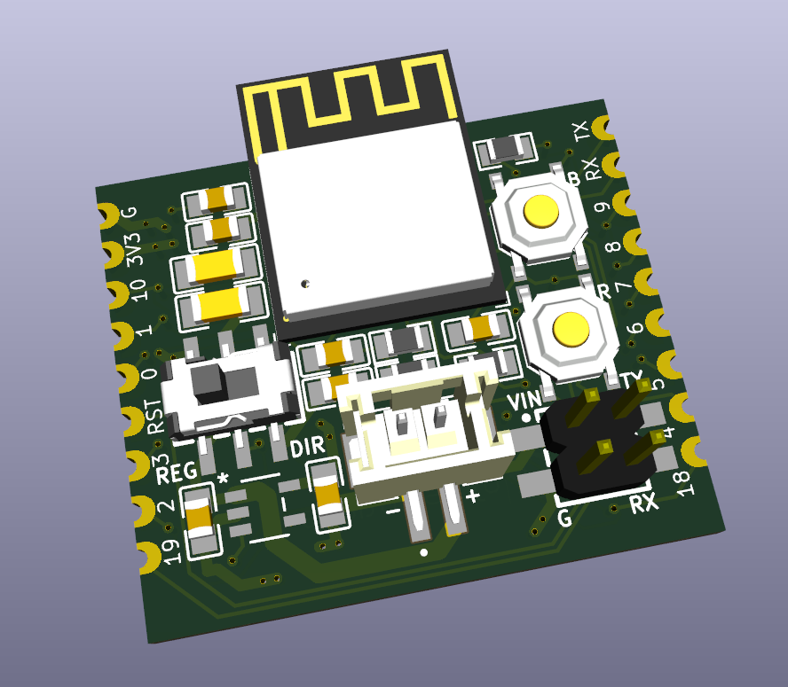
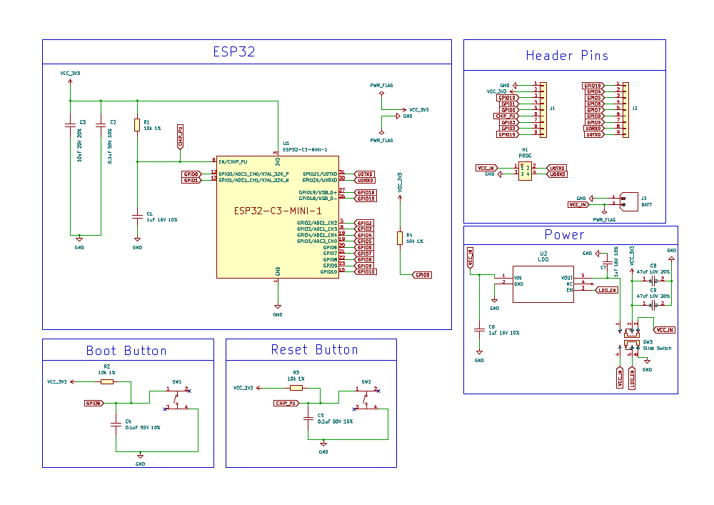

# ESP32-C3 Bare Bones (V2): Ultra-Low Power with Regulator Bypass - KiCAD Source Files

## ⚠️ This project is a work in progress. The design is finished but I still need to assemble and test a finished product. ETA Jan/Feb 2026

---

## Overview

This repository contains the KiCAD source files for the **ESP32-C3 Bare Bones Mini (V2)**, a compact, versatile, and ultra-low-power development board.

This project is a significant evolution of the [original "Bare Bones" design](https://github.com/Ben-BJD/esp32-c3-bare-bones), engineered for maximum power efficiency and flexibility. It features a unique dual-mode power system, a 4-layer PCB for improved RF performance, and a compact form factor with castellated edges, making it ideal for both battery-powered IoT prototypes and integration into larger projects.

The design prioritizes hand-assembly by using 0805 and larger SMD components where possible.

## Key Features

*   **Dual Power Modes:** A slide switch selects between a regulated input (REG on the board) for standard LiPo batteries/USB power or a direct-to-MCU bypass for ultra-low-power LiFePO4 operation (DIR on the board).
*   **Ultra-Low Deep Sleep:** Designed to achieve ~5µA deep sleep current in Direct Mode by bypassing the voltage regulator entirely.
*   **Compact & Integratable:** A minimal footprint with castellated holes on the edges allows the board to be soldered directly as a module onto a parent PCB (or solder header pins).
*   **ESP32-C3 Antenna Support:** The layout accommodates both the standard ESP32-C3-MINI-1 with a PCB antenna (overhanging the board) and the ESP32-C3-MINI-1U variant with a U.FL connector for an external antenna.
*   **Onboard Connectors:** Includes a JST-PH connector for batteries and a dedicated 4-pin header for easy programming.
*   **Improved RF Performance:** A 4-layer PCB with dedicated ground and power planes helps reduce noise and improve radio signal integrity.
*   **Hand-Solder Friendly:** Uses larger 0805 components for capacitors and resistors, making it easier to assemble by hand.

## Power System Explained

The board's most unique feature is its slide-switch-controlled dual power system.

### 1. Regulated Mode (for LiPo / 5V USB) [REG]
In this mode, power from the JST connector is routed through the onboard **RT9080 Low-Dropout (LDO) regulator**. This allows you to safely power the board with a standard 3.7V (4.2V max) LiPo battery or a 5V USB power source. This mode is ideal for development or applications where the LDO's quiescent current (typically a few microamps) is acceptable.

### 2. Direct Mode (for LiFePO4 - Ultra-Low Power) [DIR]
This mode **bypasses the LDO regulator entirely**, connecting the battery's positive terminal directly to the ESP32-C3's 3.3V rail. This eliminates the regulator's quiescent current, allowing the board to achieve its lowest possible deep sleep power consumption (~5µA). This mode is specifically designed for 3.2V (nominal) LiFePO4 batteries.

> #### ⚠️ **CRITICAL SAFETY WARNING** ⚠️
> In **Direct Mode**, there is **NO** onboard over-voltage protection. The input voltage must **NEVER exceed 3.6V**, as this will permanently damage the ESP32-C3 chip.
>
> *   Standard LiPo/Li-ion batteries (4.2V max) **CANNOT** be used in this mode.
> *   You **MUST** use a 3.2V LiFePO4 battery. Ideally charged with an external Battery Management System (BMS) that has a high-voltage cutoff at or below 3.6V. You can always test the batteries voltage first. If over 3.6V wait for it to discharge or apply small load with an LED for a few minutes.
> *   If you are unsure, always use Regulated Mode or measure the battery voltage before connecting it in Direct Mode.

## Programming

The board does not have a USB-to-UART converter to save power. You must program it using an external 3.3V FTDI programmer connected to the 4-pin `PROG` header.

Connect your FTDI programmer as follows:
*   GND -> GND
*   VCC -> 3V3 (or 5V if using Regulated Mode)
*   TX -> RX
*   RX -> TX

To enter bootloader mode, hold down the `BOOT` button, press and release the `RESET` button, and then release the `BOOT` button.

---

## Resources

*   **ESP32-C3-MINI-1 MCU Datasheet:** [PDF Link](https://www.espressif.com/sites/default/files/documentation/esp32-c3-mini-1_datasheet_en.pdf)
*   **ESP32-C3 Hardware Design Guidelines:** [Documentation Link](https://www.espressif.com/sites/default/files/documentation/esp32-c3_hardware_design_guidelines_en.pdf)

## Schematic

[PDF Version](esp32-c3-bare-bones-mini-schematic.pdf)

